# Lab 1 - Run Miyagi Locally

In this lab, you'll setup and configure Miyagi app locally.

### Task 1: Setup configuration for miyagi app

1. Open Visual Studio Code on the Lab VM by selecting the shortcut on the desktop and then double-click on it to open.

   >**Note** If **Join us in making promt-flow extension better!** window prompted please click on **No,thanks**.

   
   
1. In Visual Studio Code from menu bar select **File(1)** **Open folder(2)**,

   

1. In file explorer navigate to C:\LabFiles\miyagi select **miyagi**(1) click on **open folder(2)**

   .png)

1. In Visual Studio Code if **Do you trust the authors of the files in this folder?** window prompted click on **Yes, I trust the authors**.
   
   
1. Expand **miyagi>ui/typescript** and verify **.env.** file is present

1. Expand **miyagi/services/recommendation-service/dotnet** and verify **appsettings.json** is present.
  
1. Update appsettings.json with the values for the variables below. You can get the values from the Azure Portal.

1. To obtain the deployment model names for "deploymentOrModelId" and "embeddingDeploymentOrModelId" follow the below steps:
   
      - In Azure Portal, click on **Resource groups** from the Navigate panel.

      - From the Resource groups page, click on miyagi-rg-<inject key="DeploymentID" enableCopy="false"/>.

         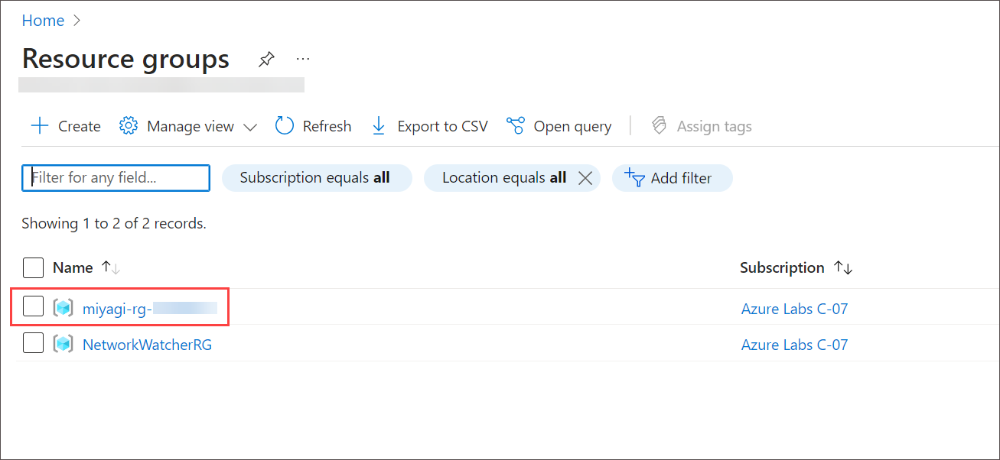

      - On **miyagi-rg-<inject key="DeploymentID" enableCopy="false"/>**, from the Overview (1) tab select the OpenAIService-<inject key="DeploymentID" enableCopy="false"/> (2).

        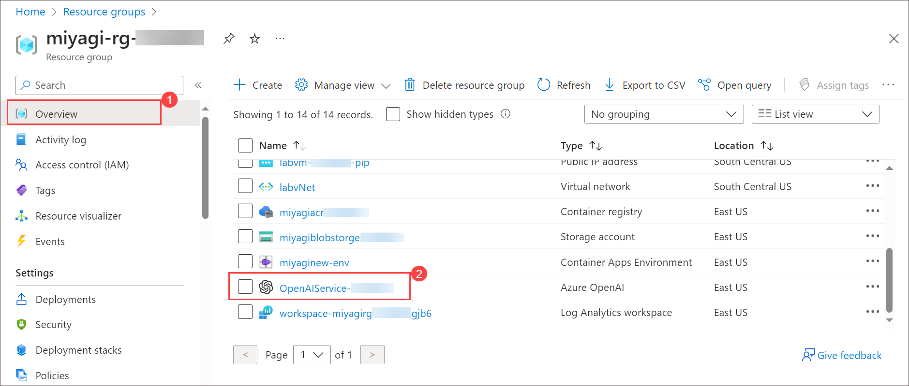

      - On the OpenAI Overview (1) page and right-click on Go to Azure OpenAI Studio (2) button and click on Open link a new tab.

          
   
      - In the Azure AI Studio, select Deployments, under Management section.
        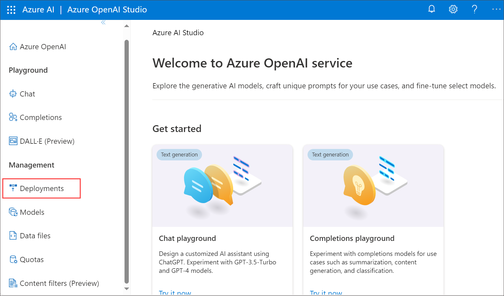

      - On the Deployments blade of Azure AI Studio, click on gpt-35-turbo model model name **(1)** and Copy full deployment name of gpt-35-turbo model **(2)** and enter copied deployment for 
        **"deploymentOrModelId"** in appsettings.json by navigating back to visual studio code.
          
        
          

          >**Note**: Kindly record deployment name of gpt-35-turbo model values in Notepad you need this values in further tasks.
      
      -  Navigate back to deployment page

      - On the Deployments blade of Azure AI Studio, click on text-embedding-ada-002 model name **(1)** and Copy full deployment name of text-embedding-ada-002 model **(2)** and enter copied deployment for 
        **"embeddingDeploymentOrModelId"** in appsettings.json by navigating back to visual studio code.   

         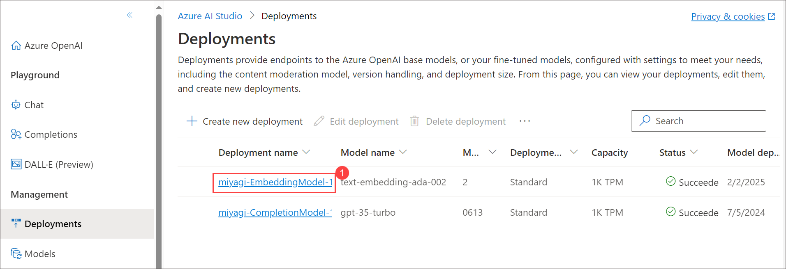

         

      >**Note**: Kindly record the text-embedding-ada-002 model name in notepad you need this values in further tasks.

1. To obtain the values for **endpoint** and **apiKey** follow the below steps:

   -  Navigate back to the tab displaying **Azure portal**. 

   -  On **OpenAIService-<inject key="DeploymentID" enableCopy="false"/>** blade, under **Resource Management** section select **Keys and Endpoint**, copy the **KEY1** and **Endpoint** values in notepad and get back to Visual studio code in appsettings.json file paste **Key to **"<Your OpenAI API Key>"**, and "endpoints" to **"<Your Open AI point>"**,

      

       >**Note**: Kindly record the **KEY1** and **Endpoint** values in notepad you need this values in next further tasks.

1. To obtain the values for  "azureCognitiveSearchEndpoint", "azureCognitiveSearchApiKey", follow below steps:
   
   1. Navigate back to miyagi-rg-<inject key="DeploymentID" enableCopy="false"/> resource group.

   1. On the miyagi-rg-<inject key="DeploymentID" enableCopy="false"/> page, select acs-<inject key="DeploymentID" enableCopy="false"/> from resources list.
   
 
   1. On acs-<inject key="DeploymentID" enableCopy="false"/> blade copy the URL and get back to Visual studio code and paste URL to **azureCognitiveSearchEndpoint**
   

      >**Note**: Please record **URL** and paste in notepad you need this values in further tasks.

   1. On acs-<inject key="DeploymentID" enableCopy="false"/> blade, under **Settings** section, copy **Primary admin Key** values and paste to **azureCognitiveSearchApiKey** 
      in visual studio code
   
      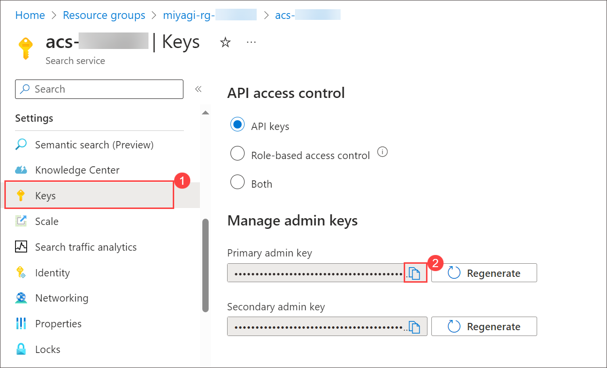

       >**Note**: Please record **Key** values in notepad you need this values in further tasks.

1. To obtain the values for "cosmosDbUri" and "cosmosDbName," please follow the steps below:

   1. Navigative back to resource group miyagi-rg-<inject key="DeploymentID" enableCopy="false"/> resource group page, select cosmos-<inject key="DeploymentID" enableCopy="false"/> from resources list.
      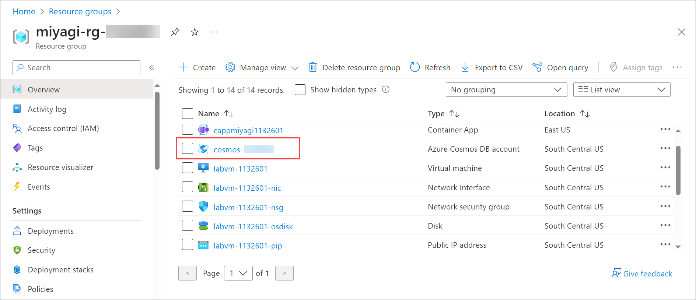

   1. On cosmos-<inject key="DeploymentID" enableCopy="false"/> copy the URL 
      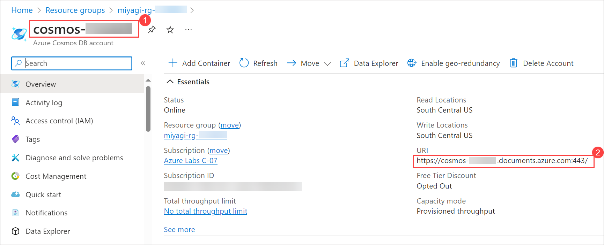

      >**Note**: Please record **URL** in notepad you need this values in further tasks.
      
   1. Get back to visual studio and paste URL to Cosmos DB URI and for cosmosDbName replace cosmos-<inject key="DeploymentID" enableCopy="false"/>

        >**Note**: Please record **Name** values in notepad you need this values in further tasks.

1. For "blobServiceUri", replace Your **blobServiceUri** with https://miyagiblobstorge<inject key="DeploymentID" enableCopy="false"/>.blob.core.windows.net/

1. Leave default settings for  "cosmosDbContainerName": "recommendations","logLevel": "Trace"

1. Once afer updating the values kindly save the file by pressing **CTRL + S**.

1. Navigate to miyagi/sandbox/usecases/rag/dotnet and verify .env file is present
  
1. Update the values which you recorded in previous steps into .env file and save the file

   >**Note**: Please refer the below image to know how to update the values in .env files.

   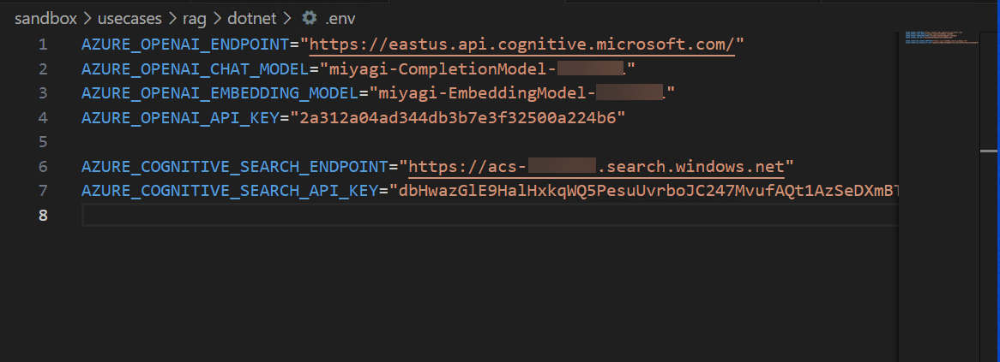

 ### Task 2: Setup .NET secrets

1. Navigate to miyagi/services/recommendation-service/dotnet, right click on dotnet and in cascading menu, select **Open in intergate Terminal**.
1. Run the following command to set the secrets for the recommendation service. You will need to provide the values for the variables below.
   
     ```
          dotnet user-secrets set "USE_OPEN_AI" "False"
          dotnet user-secrets set "serviceType" "AzureOpenAI"
          dotnet user-secrets set "BING_API_KEY" "<Your Bing API Key>"
          dotnet user-secrets set "MEMORY_COLLECTION" "miyagi-embeddings"
          dotnet user-secrets set "deploymentOrModelId" "<Your Open AI Completions model Deployment Id>"
          dotnet user-secrets set "embeddingDeploymentOrModelId" "<Your Open AI Embeddings model Deployment Id>"
          dotnet user-secrets set "endpoint" "<Your Open AI Endpoint>" 
          dotnet user-secrets set "apiKey" "<Your Open AI API Key>"
          dotnet user-secrets set "COSMOS_DB_CONNECTION_STRING" "<Cosmos DB Connection String>"
         
     ```
   Use the following instructions to get the values for the arguments to the dotnet user-secrets set command

   -  **Bing API Key:** Provide **a6a11817493b4c2cb9a49d11bcd31e98**
   -  **deploymentOrModelId** Replace <Your Open AI Completions model Deployment Id> with deployment name for gpt-35-turbo model
   -  **embeddingDeploymentOrModelId** Replace  <Your Open AI Embeddings model Deployment Id> with deployment name for text-embedding-ada-002
   -  **Open AI Endpoint**: Replace "<Your Open AI Endpoint>" with Open AI Endpoint
   -  **Open AI API Key:** Replace "<Your Open AI API Key>" with Open AI Key
   -  **Cosmos DB Connection String:** Go to Azure Portal -> Resource Groups -> select miyagi-rg-<inject key="DeploymentID" enableCopy="false"/> -> Select the cosmos-<inject key="DeploymentID" enableCopy="false"/> -> 
      Keys-> Copy the value of the Cosmos DB Primary Connection String.

      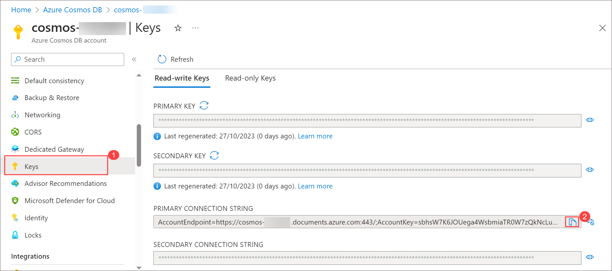

### Task 3: Understanding implementation of the recommendation service

Recommendation service implements RAG pattern using Semantic Kernel SDK. The details of the implementation are captured in the Jupyter notebook in the folder miyagi/sandbox/usecases/rag/dotnet. You can open the notebook in VSCode and run the cells to understand step by step details of how the Recommendation Service is implemented. Pay special attention to how RAG pattern is implemented using Semantic Kernel. Select kernel as .NET Interactive in the top right corner of the notebook.

1. In Visual Studio Code navigate to miyagi/sandbox/usecases/rag/dotnet folder and select **Getting-started.ipynb**
   

1. Execute the notebook cell by cell (using either Ctrl + Enter to stay on the same cell or Shift + Enter to advance to the next cell) and observe the results of each cell execution.

   

 1. Once after Excuting all the cell you need see the output as shown in below diagram.
    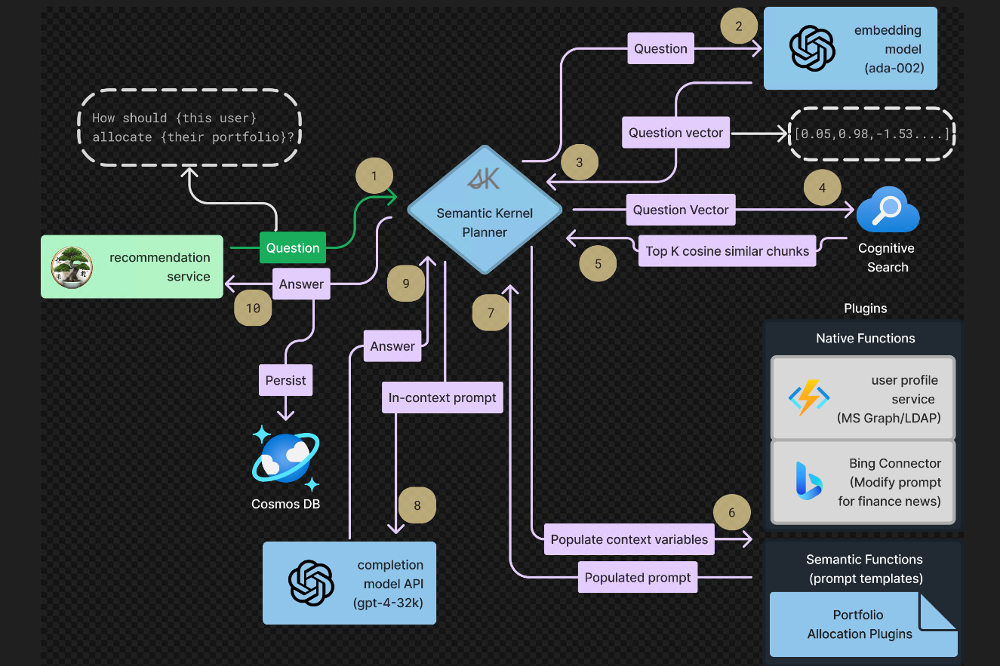
   
### Task 4: Run miyagi frontend locally

1. Open a new terminal: by navigating  miyagi/ui/typescript and right-click on **ui/typescript** , in cascading menu select **Open in intergate Terminal**.

   

1. Run the following command to install the dependencies
   
    ```
     npm install --global yarn
     yarn install
     yarn dev
    ```

   >**Note**: Wait for 5 mins and proceed with next step dont wait for script to complete.

1. Open a another tab in edge, and  browser the following
   ```
     http://localhost:4001
   ```

   Get the port from the logs in the terminal. You should see the miyagi app running locally.

   
   
### Task 5: Run recommendation service locally

1. Open a new terminal: by navigating miyagi/services/recommendation-service/dotnet and right-click on in cascade select **Open in intergate Terminal**.

    

1. Run the following command to run the recommendation service locally
    ```
     dotnet build
     dotnet run
    ```

   >**Note**: Wait for 5 mins and proceed with next step dont wait for script to complete

1. Open a another tab in edge, and  browser the following
   ```
     http://localhost:5224/swagger/index.html 
   ```

   Get the port from the logs in the terminal. You should see the swagger page for the recommendation service.

   


### Task 6: Vectorize and persist embeddings in Azure Cognitive Search

1. Within LabVm double click on **Postman** to open which is presented on desktop.
1. On **Create a free Postman account** provide email and click on **Create free account**.
1. On **Create Postman account** window, provide following information and click on **Create free account**.

   | **Settings**         | **Values**           | 
   | -------------------- | -------------------- | 
   | Email                | <inject key="AzureAdUserEmail"></inject>  | 
   | Username             | Odluser<inject key="DeploymentID" enableCopy="false"/>              |
   | Password             | Pa55w.rd1234         |
   | Stay signed in for 30 days | Select the checkbox |
   
1. If **This site is trying to open Postman.** window prompted click on **Open**.
1. If **Welcome to Postman! Tell us a bit about yourself** provide Yourname Odluser<inject key="DeploymentID" enableCopy="false"/>  and role, click on continue. 
1. On the **Postman** blade select **Workspaces** and select **My Workspace**

   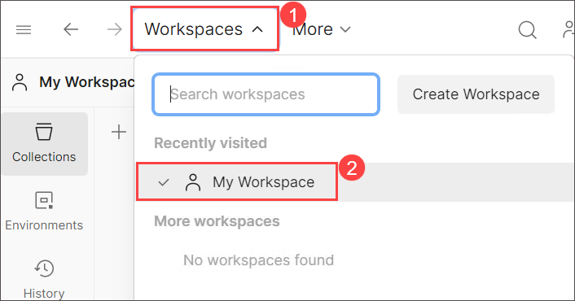

1. On the **My Workspace** blade, click on **import** 

   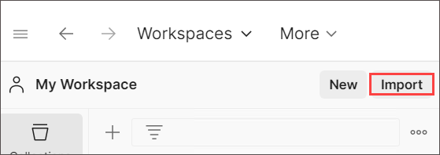

1. In **Drop anywhere to import** window, select **files** and navigate to C:\LabFiles\miyagi\services\recommendation-service\dotnet\setup.

    

1. In File explorer window Select hydate.postman_collection.json, click on **Open**.

    .png)
 
1.  Under hydrate -> Select **GET 7288/datasets(1)**  and click on **Send(2)**.

    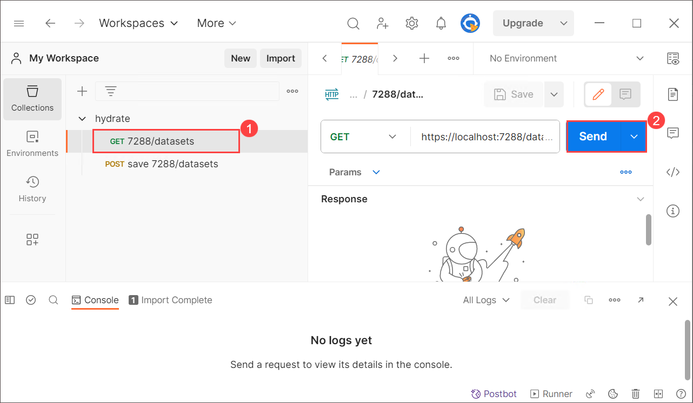
    
1.  You should see the following response
    ```
    [
    "resources\\sample-datasets\\common-stocks-uncommon-profits.txt",
    "resources\\sample-datasets\\intelligent-investor.txt",
    "resources\\sample-datasets\\random-walk-down-wall-street.txt"
    ]
    ```
1. Under hydrate -> select **POST save 7288/datasets(1)** -> click on **Send(2)**.
    
   
1. You should see the following response
   
    ```
      {
      "metadata": {
         "userId": "50",
         "riskLevel": "aggressive",
         "favoriteSubReddit": "finance",
         "favoriteAdvisor": "Jim Cramer"
      },
      "dataSetName": "intelligent-investor"

      }
    ```

### Task 7: Explore the recommendation service

1. Get back to tab where **Miyagi** ui page displaying
1. Click personalize button

    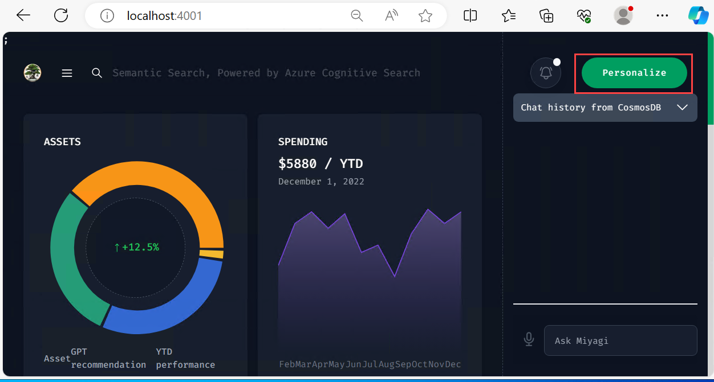

1. Notice financial advisor and click on personalize

   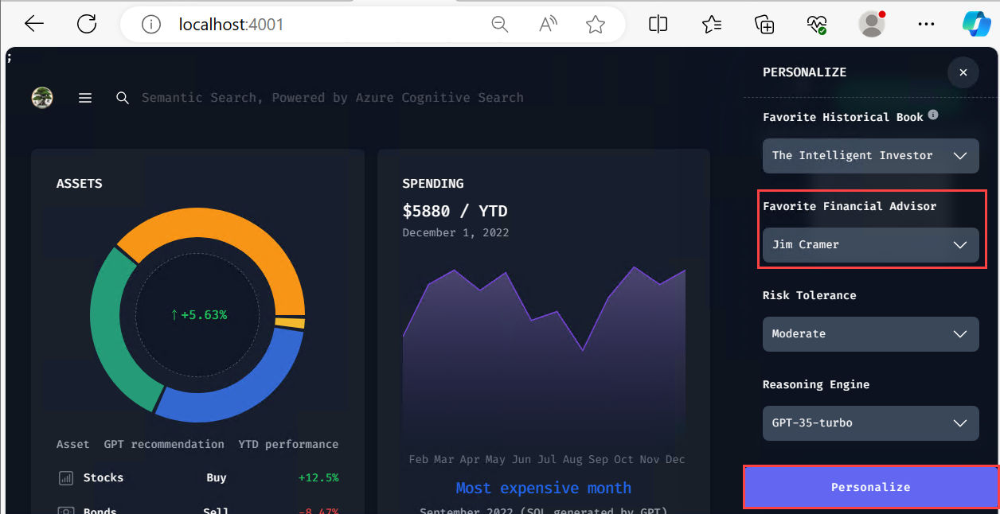

1. You should see the recommendations from the recommendation service in the Top Stocks widget.


